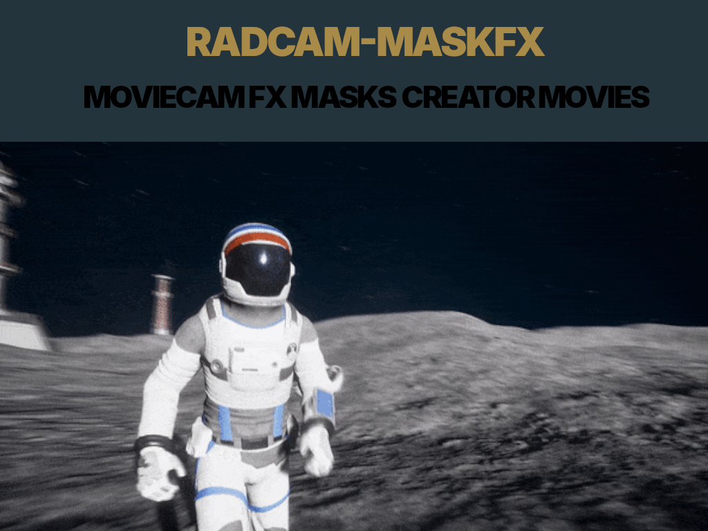

#### RADCAMFX

**CaptainComix** is a Python tool to MOVIE RECORDING images into FX sequences by overlaying video WITH GIFS, IMAGES AND MPE layers and applying visual filters.  
Inspired by APPLE FILTERS CAM and collage FX aesthetics.

Created by **#asytric**  
Contact: **eusmool@gmail.com**
---


## ✅ What *RadCam* Does

RadCam is a **live special-effects camera** system.

It takes a webcam feed in real time and:

1. **Detects the person** in the camera frame.

2. **Separates them from the background** (using segmentation).

3. **Detects objects or body parts** (face, head, hands, etc., using YOLO).

4. **Applies visual effects**, such as:

   * Background replacement (video / animated GIF / image).
   * Clothing overlays (astronaut suit, medieval armor, superhero costume).
   * Accessories (glasses, hats, masks, wings).
   * Motion-reactive effects (smoke, glow, sparks).

5. **Displays the result live** like a virtual camera window.

It can be used for:

* Streaming effects
* Video calls with custom backgrounds + masks
* Virtual cosplay
* Performance / stage visuals
* VTuber / AR performer effects

---

## ✅ File Roles in the Framework (Explained Simply)

| File                                | Purpose (Plain Description)                                                  |
| ----------------------------------- | ---------------------------------------------------------------------------- |
| `__webcam__rec__.py`                | Opens webcam and runs the live effects loop (`run_cinewiz_maskfilter()`).    |
| `__background__mask__.py`           | Finds which pixels belong to the person and which belong to the background.  |
| `__yolo__object__def.py`            | Detects objects and body parts (face, hand, hat, etc.).                      |
| `__yolo__objects__layers_detect.py` | Decides which effects to apply based on what was detected.                   |
| `__yolo__replace__objects.txt`      | A simple text file telling which accessory to use for each object.           |
| `__yolo__running.py`                | Small helper to run object detection frame-by-frame.                         |
| `__yolo_mask__filter.py`            | Applies the segmentation mask to the costume/accessory layers.               |
| `__fx_layers__.py`                  | Combines everything: webcam video + mask + overlays (hat, clothes, glasses). |
| `__setup__.py`                      | Defines directories where overlays and background videos are stored.         |
| `__requirements__.py`               | Lists needed Python libraries.                                               |

---

## ✅ High-Level Logic Flow (Explained Simply)

```
webcam frame → detect person + objects → build mask → choose accessory layers → draw overlays → show output
```

Meaning:

* The camera provides an image.
* The system figures out where the body is and where the background is.
* It identifies the head or face.
* It decides which costume / hat / glasses to display.
* It blends them together smoothly.
* It shows the final live video.

---

## ✅ Usage (In Plain Language)

You import the webcam controller and run the filter:

```
from radcam.__webcam__rec__ import run_cinewiz_maskfilter

run_cinewiz_maskfilter()
```

This opens a window showing you with effects applied live.

---

## ✅ Photoscrap (Still Image Editor)

For editing images instead of live video:

```
from photoscrap.photoscrap_editor import *
```

This is for:

* Pastes costumes into pictures
* Creates composite character art
* Meme/image manipulation

Perfect — here are **A**, **B**, and **C**, clearly and visually explained **with no code**.

---

# **A) Visual Diagram — How RadCam Works**

```
            (Webcam Image)
                     │
                     ▼
        ┌───────────────────────────┐
        │  Person Segmentation      │  ← Finds what is person vs background
        └───────────────────────────┘
                     │
                     ▼
        ┌───────────────────────────┐
        │  Object / Face Detection  │  ← Detects head, face, hands, body
        └───────────────────────────┘
                     │
         Detected labels (example):
         ["person", "face", "hat"]
                     │
                     ▼
       ┌─────────────────────────────┐
       │ Accessory Selection System  │ ← Looks up which overlays to apply
       └─────────────────────────────┘
                     │
               Selected overlays:
           - astronaut suit
           - sunglasses
           - cowboy hat
                     │
                     ▼
     ┌─────────────────────────────────────┐
     │  Overlay + Mask Layer Composer      │ ← Blends effects onto the video
     └─────────────────────────────────────┘
                     │
                     ▼
              (Final Live Video Output)
```

**In simple terms:**
RadCam first detects the person, then sees what objects/body parts exist, then chooses which effects to add, and finally blends them smoothly into the video.

---

# **B) How to Add Your Own Clothing / Hats / Glasses Overlays**

### **Where to put your custom images**

All accessories go in:

```
radcam/assets/overlays/
```

### **What kind of images to use**

| Feature    | Recommendation                                    |
| ---------- | ------------------------------------------------- |
| Format     | PNG (important because PNG supports transparency) |
| Resolution | At least 400–800px wide                           |
| Background | Must be transparent (not white/black/green!)      |

### **Examples of good accessory files**

* `hat_cowboy.png`
* `helmet_space.png`
* `glasses_round.png`
* `cape_superhero.png`

### **How RadCam knows which accessory to use**

Inside:

```
radcam/__yolo__replace__objects.txt
```

You assign a label → overlay:

```
face => glasses_round.png
person => suit_knight.png
hat => crown_gold.png
```

So if a **face** is detected → **glasses** appear.
If a **person** is detected → their **clothing costume** appears.

**No programming needed**, just editing text.

---

# **C) How to Use Animated Backgrounds (Looping MP4 or GIF)**

### **Where to put background videos**

Store them here:

```
radcam/assets/videos/
```

Examples:

* `space_station.mp4`
* `wild_west_desert.mp4`
* `anime_city_loop.gif`

### **How it works conceptually**

1. RadCam separates the person from the background.
2. The removed background is replaced with your chosen video.
3. The video loops continuously behind the person in real-time.

### **Examples of thematic setups**

| Theme     | Costume Overlay           | Background Video              |
| --------- | ------------------------- | ----------------------------- |
| Cowboy    | cowboy hat + leather vest | desert sunset town loop       |
| Astronaut | astronaut suit            | space station or nebula field |
| Cyberpunk | neon visor + jacket       | glitch city rain loop         |

### **Important**

To look natural, animated backgrounds should:

* Loop smoothly
* Not move too fast
* Have colors that contrast with the character

---

# ✅ Summary — You Now Understand

| Feature                      | You Know How To Use                 |
| ---------------------------- | ----------------------------------- |
| Live Effects Flow            | ✔️ (Diagram)                        |
| Add clothes / hats / glasses | ✔️ (Place PNGs + edit mapping text) |
| Use animated backgrounds     | ✔️ (Put MP4/GIF in `assets/videos`) |

---

#### EXAMPLES:

Excellent — **D) Full Costume Pack Design**
No code — just clear structure, styling direction, and asset naming.
This will tell you **exactly which PNG layers to create** and how to organize them so RadCam can use them immediately.

---

# 🎭 **RadCam Costume Pack: “Cinematic Characters Vol. 1”**

Each costume includes:

* **Clothing overlay** (torso + shoulders)
* **Head accessory** (helmet / hat / hood)
* **Face element** (visor / mask / glasses)
* Optional: **prop** (hand-held object, shown only when detection finds “hand”)

Place everything in:

```
radcam/assets/overlays/
```

---

## 1) **Astronaut**

**Theme:** NASA / ISS / Realistic Space Explorer

| Layer            | File Name                  | Description                                 |
| ---------------- | -------------------------- | ------------------------------------------- |
| Suit / Body      | `astronaut_suit.png`       | White EVA suit with chest controls visible  |
| Helmet           | `astronaut_helmet.png`     | Clear visor with slight reflection gradient |
| Visor reflection | `astronaut_visor_glow.png` | Low-opacity gold sheen overlay              |
| Prop (Optional)  | `astronaut_flag.png`       | Small waving flag held near right hand      |

**Background suggestion:** softly moving nebula, space station window, earth horizon

---

## 2) **Cowboy**

**Theme:** Wild West Film Mood

| Layer                                                                                      | File Name |
| ------------------------------------------------------------------------------------------ | --------- |
| `cowboy_vest.png`                                                                          |           |
| `cowboy_hat.png`                                                                           |           |
| `cowboy_scarf_bandana.png`                                                                 |           |
| `cowboy_revolver.png` (optional, stylized, **toy-like** to avoid realistic weapon imagery) |           |

**Background suggestions:** sunset desert, western saloon, dusty canyon

---

## 3) **Samurai**

**Theme:** Decorative armor, not military

| Layer | File Name |
|------|
| `samurai_armor.png` |
| `samurai_kabuto_helmet.png` |
| `samurai_face_mask.png` (optional half-mask style) |
| `samurai_katana_pose.png` (prop – angled diagonally for dramatic look) |

**Background suggestions:** cherry blossom garden, Japanese castle courtyard, moonlit temple

---

## 4) **Cyberpunk Runner**

**Theme:** Neon + metallic

| Layer | File Name |
|------|
| `cyberpunk_jacket.png` |
| `cyber_neon_visor.png` |
| `cyber_led_tattoos.png` |
| `cyber_data_blade.png` (optional prop) |

**Glow rule:** use **pink/cyan** color accents for consistency.

**Background suggestions:** neon city alley rain, hologram markets, glitch grid

---

## 5) **Angel / Seraph**

**Theme:** Elegant, luminous, soft aura

| Layer | File Name |
|------|
| `angel_robe.png` |
| `angel_wings.png` (semi-transparent feather fade edges) |
| `angel_halo.png` (above head) |
| `angel_aura_glow.png` (subtle radial bloom) |

**Background suggestions:** bright sky gradient, cathedral interior, sunrise clouds

---

## 6) **Demon / Shadow Fiend**

**Theme:** Dark fantasy with glowing eyes

| Layer | File Name |
|------|
| `demon_torso_armor.png` |
| `demon_horns.png` |
| `demon_eye_glow.png` |
| `demon_shadow_wings.png` (ragged, smoke-like transparency) |

**Pro tip:** wings should be **dark with feathered alpha**, not hard edges.

---

# 🎨 **Unified Art Style Guidelines**

To ensure all costumes look “from the same film universe”:

| Aspect         | Recommendation                                            |
| -------------- | --------------------------------------------------------- |
| Resolution     | Design overlays at least **1200px tall**                  |
| Edge treatment | Soft transparency edges, not hard cutouts                 |
| Lighting       | One light source, upper-left preferred                    |
| Outlines       | Avoid cartoon outlines → aim semi-realistic matte texture |
| Color grade    | Slight warm tint for skin-region overlays                 |

---

# 🗂 Folder Organization

```
radcam/
  assets/
    overlays/
      astronaut_suit.png
      astronaut_helmet.png
      cowboy_hat.png
      samurai_kabuto_helmet.png
      cyberpunk_jacket.png
      angel_wings.png
      demon_horns.png
      ...etc
    videos/
      space_loop.mp4
      western_sunset_loop.mp4
      neon_city_loop.mp4
      clouds_heaven_loop.mp4
      abyss_fog_loop.mp4
```

Great — **F) VTuber-Style Facial Expression & Face-Mask Filter Design**
No code, just clear visual + structural guidance so the effect looks **alive**, not static.

---

# 🎭 What VTuber-Style Means

Instead of replacing the whole face, we **re-interpret** the user’s expression in a stylized way:

| Feature    | Before (Camera)  | After (VTuber Style)                                    |
| ---------- | ---------------- | ------------------------------------------------------- |
| Eyes       | Real eyes        | Anime / digital eyes that blink and track gaze          |
| Mouth      | Real mouth       | Smooth-drawn mouth shapes synchronized to sound         |
| Face Shape | Real proportions | Softened / stylized character face profile              |
| Hair       | Real or replaced | Layered anime hair, masks, or semi-transparent outlines |

It **enhances** real motion instead of replacing it completely.

---

# 🧩 Core Components Needed

| Layer                 | Purpose                                          |
| --------------------- | ------------------------------------------------ |
| **Eye Layer**         | Tracks eye direction, contains open/blink shapes |
| **Mouth Layer Set**   | Changes shape based on speaking / silence        |
| **Face Tint Overlay** | Soft shading to give anime skin style            |
| **Accessories**       | Ears, horns, ribbons, bangs, eyebrows            |
| **Hair Layers**       | Multiple layers to simulate depth and motion     |

---

# 🎨 Art Style Specification (For Consistency)

| Parameter  | Style                                                   |
| ---------- | ------------------------------------------------------- |
| Line style | **Soft brush + anti-aliased edges**                     |
| Shadows    | **Single gradient shadow**, avoid multi-shade rendering |
| Colors     | Pastel / Warm Hue Shift (Avoid over-saturated neon)     |
| Eyes       | Large highlight, double reflection spark                |
| Mouth      | Simple shape → no teeth detail                          |

---

# 🎭 Facial Expression Set (Recommended)

Create these as separate PNG layers:

| Expression Code | Meaning                 | Layer File Name                           |
| --------------- | ----------------------- | ----------------------------------------- |
| NEU             | Neutral                 | `eyes_neutral.png` + `mouth_neutral.png`  |
| BLN             | Blink                   | `eyes_blink.png`                          |
| SMH             | Smile                   | `mouth_smile.png`                         |
| OPN             | Speaking / vowel shapes | `mouth_open.png`                          |
| HPP             | Happy                   | `eyes_happy.png` + `mouth_smile_open.png` |
| SMP             | Smirk                   | `mouth_side_smirk.png`                    |
| OMG             | Surprise / Shock        | `eyes_wide.png` + `mouth_O.png`           |
| ANGRY           | Energetic / Frustrated  | `eyes_angry.png` + `mouth_slanted.png`    |

**Tip:** Eyes should have **multiple** frames for blinking → smooth animation.

---

# 🐱 VTuber Accessory Sets (Pick One Theme)

## 1) **Cat / Kitsune / Wolf Vibes**

* `ears_cat.png`
* `tail_cat.png`
* `blush_soft.png`

## 2) **Robot / Cyborg**

* `face_panel_lines.png` (thin glowing tracers)
* `eye_led.png`
* `mouth_led_bar.png`

## 3) **Demon / Succubus**

* `horns_curve.png`
* `fangs_small.png`
* `red_eye_glow_subtle.png`

## 4) **Angel / Idol**

* `halo_tilted.png`
* `sparkle_blink_effect.png`
* `soft_aura_cheeks.png`

---

# 👁 Eye Layer Construction (Very Important)

Each eye = 3 separate layers (for motion):

```
iris.png        ← moves left/right/up/down
eye_white.png   ← static
eye_outline.png ← defines shape and style
```

### Highlights:

Add **2 light-reflection highlights**:

* main circle highlight (top left)
* small sparkle highlight (bottom right)

This makes eyes look **alive**.

---

# 👄 Mouth Layer Construction

Mouth should **not show teeth**.

```
closed → smile → open (round) → wide open (speaking)
```

The mount shape can be switched depending on:

* sound volume (voice reactive)
* smile detection
* vowel shape approximation (optional)

---

# 🦊 Hair Layer System (Depth Illusion)

Use **3 layers**:

```
bangs_front.png       (front-most)
head_mid_hair.png     (main volume layer)
hair_back.png         (behind head)
```

This avoids the “paper flat” look.

---

# ✅ Summary — You now know how to create a VTuber-style avatar overlay:

| Component      | Meaning                                         |
| -------------- | ----------------------------------------------- |
| Eyes System    | Multi-frame, highlight detail                   |
| Mouth System   | Several shapes for speaking/blinking emotions   |
| Hair Layers    | Multi-layer depth for realism                   |
| Accessories    | Ears / horns / halos / tails optional           |
| Expression Set | NEU, BLINK, SMILE, SURPRISE, HAPPY, ANGRY, etc. |

---

